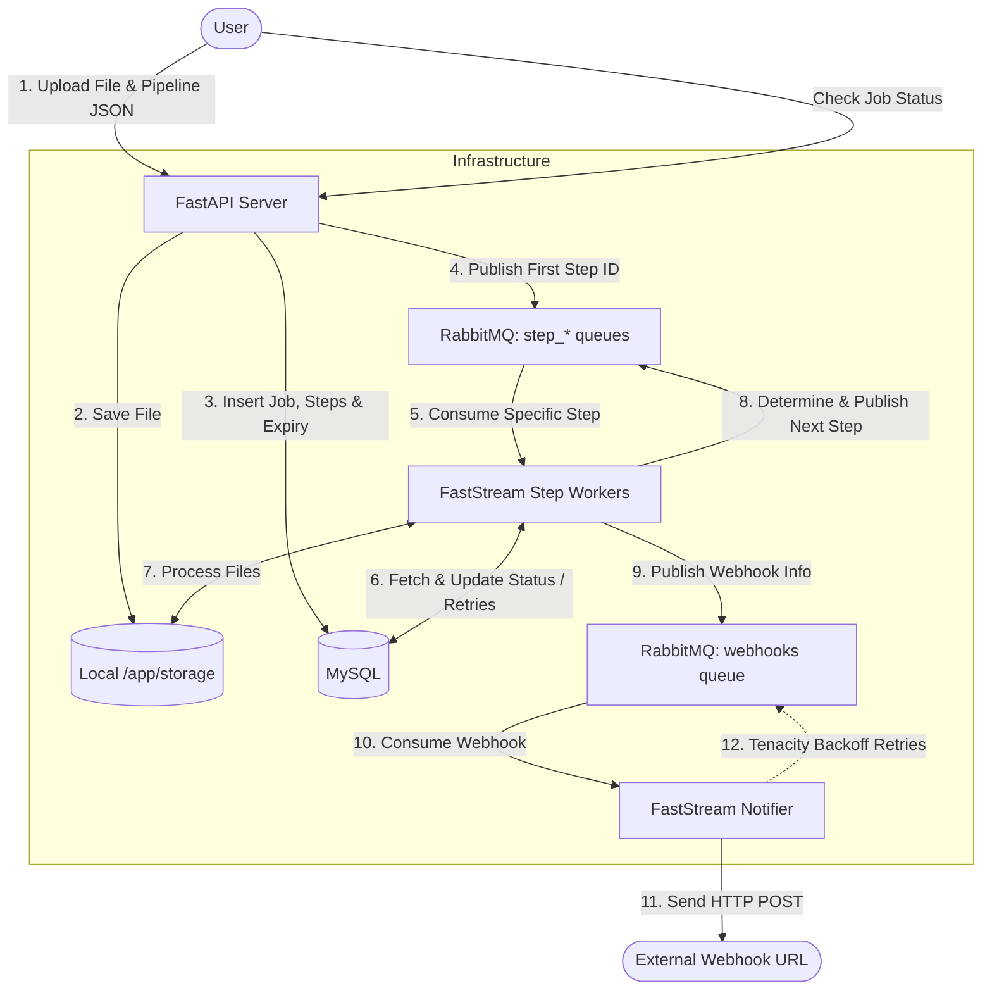

# System Overview

The File Processing Pipeline is an asynchronous, event-driven system orchestrated by **Docker Compose**. It utilizes **FastAPI** for the frontend API, **RabbitMQ** as the message broker, **FastStream** for the queue consumers, **MySQL** for state management, and **Logfire** for distributed tracing.

### Component Breakdown
1. **API Server (`api`)**: Handles file streaming to disk, saves initial DB records (including a 24-hour retention expiry), and publishes the start signal to the exact RabbitMQ queue corresponding to the first step in the pipeline. Runs a background APScheduler cron for automated file cleanup.
2. **Worker Choreography (`worker`)**: Uses distributed event choreography rather than a monolithic loop. FastStream subscribes to isolated queues (`step_validate`, `step_transform`, `step_compress`, etc.). Each handler independently processes its step, tracks retries via MySQL, and publishes a message to the *next* step's queue upon completion. It seamlessly orchestrates Fan-Out/Fan-In Subjobs during Zip Extractions.
3. **Notifier (`notifier`)**: An isolated worker dedicated solely to external HTTP calls. Backed by `tenacity`, it provides exponential backoff retries. If an external webhook is down, it retries up to 5 times before failing over to RabbitMQ for dead-lettering, entirely detached from core data processing.
4. **Logfire**: Automated OpenTelemetry tracing. Every FastAPI request, SQLAlchemy transaction, HTTPX outbound webhook, and FastStream background operation is structured, logged, and shipped to the Logfire dashboard.
5. **RabbitMQ**: Decouples the fast API layer from the slow processing layer and provides the communication backbone between the disparate, decoupled step workers.
6. **MySQL**: Tracks the exact state (`PENDING`, `RUNNING`, `COMPLETED`, `FAILED`, `SKIPPED`), execution duration timings, and retry counts of every job and sub-step.
