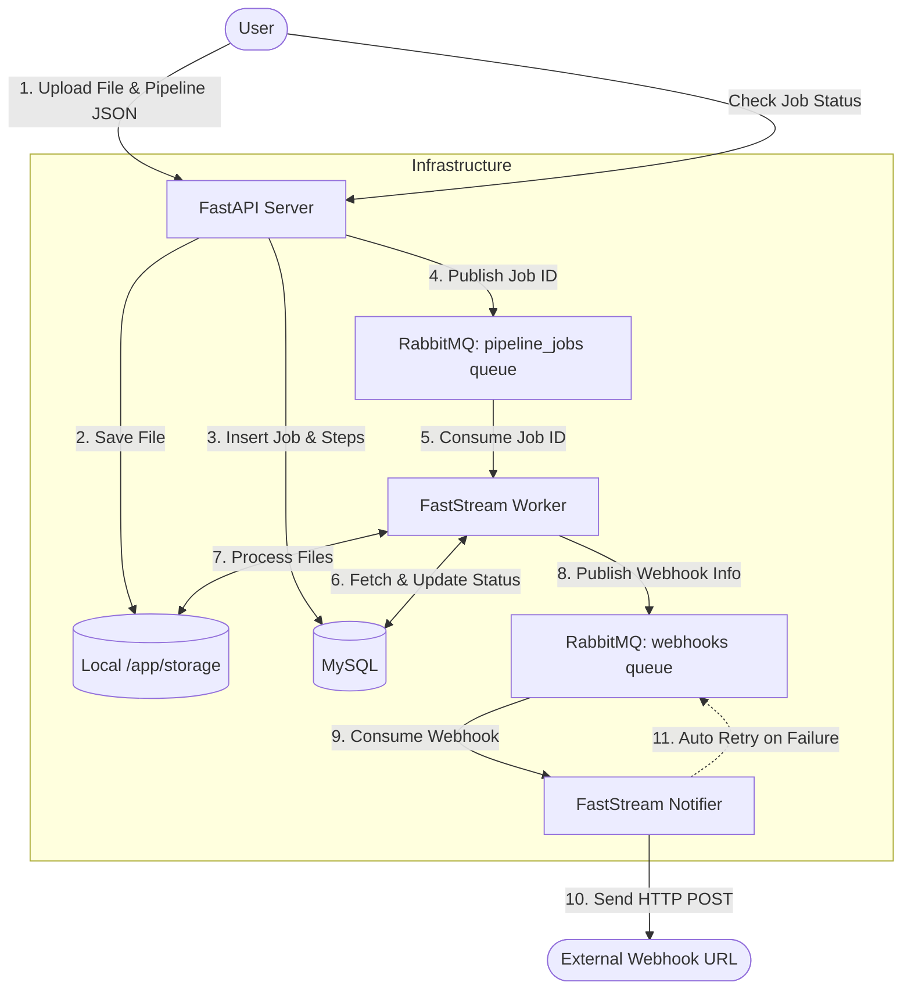

# System Overview

The File Processing Pipeline is an asynchronous, event-driven system orchestrated by **Docker Compose**. It utilizes **FastAPI** for the frontend API, **RabbitMQ** as the message broker, **FastStream** for the queue consumers, and **MySQL** for state management.

### Component Breakdown
1. **API Server (`api`)**: Handles file streaming to disk, saves initial DB records, and publishes the start signal to RabbitMQ. Provides endpoints for status polling.
2. **Worker (`worker`)**: The heavy lifter. Consumes the job ID, fetches the steps from MySQL, executes the pipeline sequence (validate, transform, etc.), and updates the status.
3. **Notifier (`notifier`)**: An isolated worker dedicated solely to external HTTP calls. If an external webhook is down, the Notifier handles the failure and retries without blocking the main data pipeline.
4. **RabbitMQ**: Decouples the fast API layer from the slow processing layer.
5. **MySQL**: Tracks the exact state (`PENDING`, `RUNNING`, `COMPLETED`, `FAILED`) of every job and sub-step.
